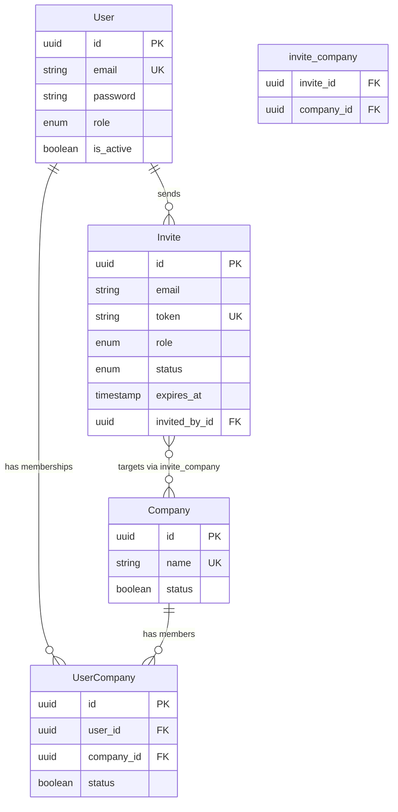

# Domain Model

Living reference for what each entity means in **binder_app_backend** and why relationships exist. Read this before designing new entities or relations.

**Maintenance rule:** update this file whenever a new entity or relationship is added or changed. Do not skip — agents and developers rely on it for business context.

## Domain Overview

The app uses a **multi-company access model**. A single user can belong to multiple company units, and each company unit can have multiple users. Authentication is user-scoped (one login, one JWT); company access is resolved on every request from active `UserCompany` memberships. Revoking access (`status=false` on the link) takes effect on the next request without re-login.

## Entity Relationship Diagram

## Entity Catalog

### User

| | |
|---|---|
| **Business role** | Represents a person who authenticates and operates inside the app. Handles login, authorization by role, and password recovery. |
| **Source file** | `src/user/user.entity.ts` |
| **Module** | `src/user/user.module.ts` (repository also registered in `AuthModule`) |

**Key fields**

| Field | Business meaning |
|-------|------------------|
| `name` | Display name of the person |
| `email` | Unique login identifier |
| `password` | Hashed credential; never returned in queries (`select: false`) |
| `role` | App-wide permission level (`superadmin`, `editor`, `viewer`) — see `src/common/role.enum.ts` |
| `isActive` | Whether the account can authenticate |
| `passwordResetToken` / `passwordResetExpires` | Temporary credentials for password recovery flow |
| `createdAt` / `updatedAt` | Audit timestamps |

**Used by**

- `src/auth/auth.service.ts` — login, password reset
- `src/auth/auth.guard.ts` — JWT validation; loads `userCompanies` to build session
- `src/auth/userSignature.type.ts` — exposes `companyIds` from active memberships
- `src/user/user.service.ts` — profile and user detail endpoints
- `src/database/seeds/default.ts` — seed admin user and company link

**Relationships**

| Related entity | Type | Owning side | Business reason |
|----------------|------|-------------|-----------------|
| UserCompany | OneToMany | UserCompany (`user_id` FK) | User has zero or more company memberships |
| Invite | OneToMany | Invite (`invited_by_id` FK) | User sends zero or more invites |

---

### Company

| | |
|---|---|
| **Business role** | Represents a company unit (organizational scope) in the app. Users operate within the context of the companies they are linked to. |
| **Source file** | `src/company/company.entity.ts` |
| **Module** | `src/company/company.module.ts` |

**Key fields**

| Field | Business meaning |
|-------|------------------|
| `name` | Full company unit name (unique) |
| `status` | Whether the company unit is active; inactive companies are excluded from `companyIds` |
| `description` | Human-readable description of the unit |
| `createdAt` / `updatedAt` | Audit timestamps |

**Used by**

- `src/auth/auth.guard.ts` — resolves `companyIds` for the authenticated session
- `src/company/company.service.ts` — list and detail endpoints
- `src/database/seeds/default.ts` — seed default company and link to admin user

**Relationships**

| Related entity | Type | Owning side | Business reason |
|----------------|------|-------------|-----------------|
| UserCompany | OneToMany | UserCompany (`company_id` FK) | Company has zero or more user memberships |

---

### UserCompany

| | |
|---|---|
| **Business role** | Membership / access grant linking a user to a company unit. Controls whether a logged-in user may access that company. |
| **Source file** | `src/user-company/user-company.entity.ts` |
| **Module** | Registered in `AuthModule` via `TypeOrmModule.forFeature` |

**Key fields**

| Field | Business meaning |
|-------|------------------|
| `user` | The user granted access |
| `company` | The company unit being accessed |
| `status` | `true` = permitted; `false` = soft-revoked (link kept for audit, access denied) |
| `createdAt` / `updatedAt` | Audit timestamps |

**Used by**

- `src/auth/auth.guard.ts` — filters active memberships into `companyIds`
- `src/auth/auth.service.ts` — loads memberships on login
- `src/database/seeds/default.ts` — creates admin ↔ company link with `status: true`

**Relationships**

| Related entity | Type | Owning side | Business reason |
|----------------|------|-------------|-----------------|
| User | ManyToOne | UserCompany | Each membership belongs to one user |
| Company | ManyToOne | UserCompany | Each membership targets one company |

**Access revocation:** set `status=false` on the row. The user stays logged in; on the next request `AuthGuard` reloads memberships and excludes the revoked company from `companyIds`.

---

### Invite

| | |
|---|---|
| **Business role** | Stores invite-flow data before a user gains company access. One invite can target multiple companies with a single token and role. On accept, creates `UserCompany` rows and sets the invitee's global role. |
| **Source file** | `src/invite/invite.entity.ts` |
| **Module** | `src/invite/invite.module.ts` |

**Key fields**

| Field | Business meaning |
|-------|------------------|
| `email` | Invitee email address (normalized to lowercase in service layer) |
| `token` | Unique public token for accept/refuse links (no auth required) |
| `role` | App-wide role to assign on accept (`superadmin`, `editor`, `viewer`) |
| `status` | Lifecycle: `pending`, `accepted`, `refused`, `expired`, `cancelled` |
| `expiresAt` | Invite expiry (default 7 days); passed invites become `expired` |
| `acceptedAt` / `refusedAt` / `cancelledAt` | Timestamps for terminal transitions |
| `invitedBy` | User who sent the invite |
| `companies` | One or more company units included in this invite |
| `createdAt` / `updatedAt` | Audit timestamps |

**Lifecycle**

| Status | Terminal? | Next actions |
|--------|-----------|--------------|
| `pending` | No | Accept, refuse, cancel, or expire |
| `expired` | No | Resend (new token + expiry → `pending`) or cancel |
| `accepted` | Yes | Flow complete — `UserCompany` rows created |
| `refused` | Yes | Flow complete — invitee declined |
| `cancelled` | Yes | Flow complete — inviter revoked invite |

**Used by**

- `src/invite/invite.service.ts` — full invite lifecycle:
  - `POST /invite` — create + email (Editor/Superadmin)
  - `GET /invite` — list sent invites
  - `POST /invite/:id/cancel` — cancel pending/expired
  - `POST /invite/:id/resend` — resend expired
  - `POST /invite/accept` — public; creates **new user only** (rejects existing email)
  - `POST /invite/refuse` — public; marks refused
- `src/mail/mail.service.ts` — `sendInviteEmail` on create/resend

**Accept constraint:** invite accept is for **new users only**. If the email already exists, create and accept both reject — role/company changes for existing users belong to a separate flow.

**Relationships**

| Related entity | Type | Owning side | Business reason |
|----------------|------|-------------|-----------------|
| User | ManyToOne | Invite (`invited_by_id` FK) | Every invite is sent by one user |
| Company | ManyToMany | Invite (`invite_company` junction) | One invite can grant access to multiple companies at once |

**Authorization rules (enforced in service, not entity):**

- Superadmin: invite to any active company; assign any role
- Editor: invite only to companies they belong to; assign `editor` or `viewer` only
- Viewer: cannot invite

---

## Relationship Map

| From | To | Type | Junction / FK | Owning side | Business rationale |
|------|----|------|---------------|-------------|-------------------|
| User | UserCompany | OneToMany | `user_company.user_id` | UserCompany | User has multiple company memberships |
| Company | UserCompany | OneToMany | `user_company.company_id` | UserCompany | Company has multiple user memberships |
| User | Company | ManyToMany (via UserCompany) | `user_company` | UserCompany | Multi-company access with per-link `status` for soft revoke |
| User | Invite | OneToMany | `invite.invited_by_id` | Invite | User sends zero or more invites |
| Invite | Company | ManyToMany | `invite_company` | Invite | One invite can target multiple companies in a single flow |

**Junction table `user_company`**

- Explicit entity (`UserCompany`) with `id`, `status`, and timestamps
- `UNIQUE (user_id, company_id)` — one link per user–company pair
- `status=false` = soft revoke; no re-login required for change to take effect
- Link example: `src/database/seeds/default.ts` (find or create `UserCompany` with `status: true`)

**Junction table `invite_company`**

- Managed by TypeORM `@JoinTable` on `Invite` (no inverse on `Company`)
- Columns: `invite_id`, `company_id`
- `UNIQUE (invite_id, company_id)` — one link per invite–company pair
- No extra fields on junction; invite metadata lives on `Invite` row

---

## New Entity Template

Copy this section when adding the next entity. Replace placeholders and move it above this template block.

### \<EntityName\>

| | |
|---|---|
| **Business role** | \<Why this entity exists in the domain\> |
| **Source file** | `src/\<feature\>/\<feature\>.entity.ts` |
| **Module** | `src/\<feature\>/\<feature\>.module.ts` |

**Key fields**

| Field | Business meaning |
|-------|------------------|
| \<field\> | \<meaning\> |

**Used by**

- \<module or service that consumes this entity\>

**Relationships**

| Related entity | Type | Owning side | Business reason |
|----------------|------|-------------|-----------------|
| \<Entity\> | \<OneToMany / ManyToOne / ManyToMany / OneToOne\> | \<side\> | \<why this relation exists\> |

After adding a section:

1. Update the **Relationship Map** table above
2. Update the **mermaid diagram** at the top
3. Update inverse relations on any affected existing entities (in code)
