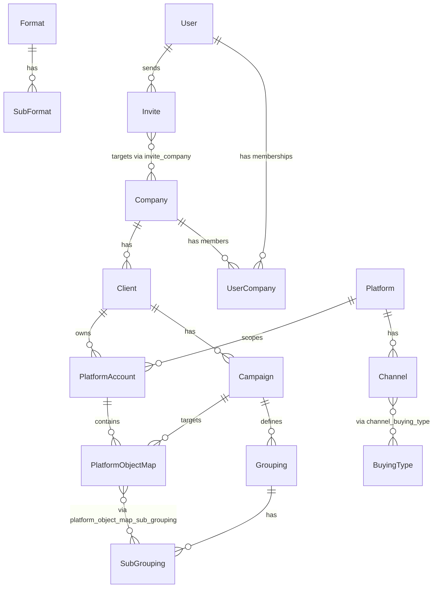

# Domain Model

Living reference for what each entity means in **binder_app_backend** and why relationships exist. Read this before designing new entities or relations.

**Maintenance rule:** update this file whenever a new entity or relationship is added or changed. Do not skip — agents and developers rely on it for business context.

## Domain Overview

The app uses a **multi-company access model** and a **layered data-lake brain** architecture:

- **Access layer** — who can use the system (`User`, `Company`, `UserCompany`, `Invite`)
- **Business layer** — organizational spine (`Company → Client → Campaign`)
- **Media layer** — reference catalogs for classifying ads (`Platform`, `Channel`, `BuyingType`, `Format`, `SubFormat`, `Grouping`, `SubGrouping`)
- **Bridge layer** — maps platform-native IDs from ETL to Binder meaning (`PlatformAccount`, `PlatformObjectMap`)

Authentication is user-scoped (one login, one JWT); company access is resolved on every request from active `UserCompany` memberships.

**Catalog scoping:** `Platform`, `Channel`, `BuyingType`, `Format`, `SubFormat` are **global**. `Grouping` / `SubGrouping` are **campaign-scoped** (strategic dimensions vary per campaign).

## Entity Relationship Diagram

## Entity Catalog

### User

| | |
|---|---|
| **Business role** | Represents a person who authenticates and operates inside the app. Handles login, authorization by role, and password recovery. |
| **Source file** | `src/user/user.entity.ts` |
| **Module** | `src/user/user.module.ts` (repository also registered in `AuthModule`) |

**Key fields**

| Field | Business meaning |
|-------|------------------|
| `name` | Display name of the person |
| `email` | Unique login identifier |
| `password` | Hashed credential; never returned in queries (`select: false`) |
| `role` | App-wide permission level (`superadmin`, `editor`, `viewer`) — see `src/common/role.enum.ts` |
| `isActive` | Whether the account can authenticate |
| `passwordResetToken` / `passwordResetExpires` | Temporary credentials for password recovery flow |
| `createdAt` / `updatedAt` | Audit timestamps |

**Used by**

- `src/auth/auth.service.ts` — login, password reset
- `src/auth/auth.guard.ts` — JWT validation; loads `userCompanies` to build session
- `src/auth/userSignature.type.ts` — exposes `companyIds` from active memberships
- `src/user/user.service.ts` — profile and user detail endpoints
- `src/database/seeds/default.ts` — seed admin user and company link

**Relationships**

| Related entity | Type | Owning side | Business reason |
|----------------|------|-------------|-----------------|
| UserCompany | OneToMany | UserCompany (`user_id` FK) | User has zero or more company memberships |
| Invite | OneToMany | Invite (`invited_by_id` FK) | User sends zero or more invites |

---

### Company

| | |
|---|---|
| **Business role** | Represents a company unit (organizational scope) in the app. Users operate within the context of the companies they are linked to. |
| **Source file** | `src/company/company.entity.ts` |
| **Module** | `src/company/company.module.ts` |

**Key fields**

| Field | Business meaning |
|-------|------------------|
| `name` | Full company unit name (unique) |
| `status` | Whether the company unit is active; inactive companies are excluded from `companyIds` |
| `description` | Human-readable description of the unit |
| `createdAt` / `updatedAt` | Audit timestamps |

**Used by**

- `src/auth/auth.guard.ts` — resolves `companyIds` for the authenticated session
- `src/company/company.service.ts` — list and detail endpoints
- `src/database/seeds/default.ts` — seed default company and link to admin user

**Relationships**

| Related entity | Type | Owning side | Business reason |
|----------------|------|-------------|-----------------|
| UserCompany | OneToMany | UserCompany (`company_id` FK) | Company has zero or more user memberships |

---

### UserCompany

| | |
|---|---|
| **Business role** | Membership / access grant linking a user to a company unit. Controls whether a logged-in user may access that company. |
| **Source file** | `src/user-company/user-company.entity.ts` |
| **Module** | `src/user-company/user-company.module.ts` (service-only; imported by `UserModule`) |

**Key fields**

| Field | Business meaning |
|-------|------------------|
| `user` | The user granted access |
| `company` | The company unit being accessed |
| `status` | `true` = permitted; `false` = soft-revoked (link kept for audit, access denied) |
| `createdAt` / `updatedAt` | Audit timestamps |

**Used by**

- `src/auth/auth.guard.ts` — filters active memberships into `companyIds`
- `src/auth/auth.service.ts` — loads memberships on login
- `src/user-company/user-company.service.ts` — grant, revoke, bulk sync (Superadmin only)
- `src/user-company/user-company.controller.ts` — `PATCH /user-company/:id/revoke`, `PUT /user-company/user/:userId/sync`
- `src/database/seeds/default.ts` — creates admin ↔ company link with `status: true`

**Relationships**

| Related entity | Type | Owning side | Business reason |
|----------------|------|-------------|-----------------|
| User | ManyToOne | UserCompany | Each membership belongs to one user |
| Company | ManyToOne | UserCompany | Each membership targets one company |

**Access revocation:** set `status=false` on the row (via `UserCompanyService.revokeById` using the membership row PK). Grant/revoke/sync require Superadmin. The user stays logged in; on the next request `AuthGuard` reloads memberships and excludes the revoked company from `companyIds`.

---

### Invite

| | |
|---|---|
| **Business role** | Stores invite-flow data before a user gains company access. One invite can target multiple companies with a single token and role. On accept, creates `UserCompany` rows and sets the invitee's global role. |
| **Source file** | `src/invite/invite.entity.ts` |
| **Module** | `src/invite/invite.module.ts` |

**Key fields**

| Field | Business meaning |
|-------|------------------|
| `email` | Invitee email address (normalized to lowercase in service layer) |
| `token` | Unique public token for accept/refuse links (no auth required) |
| `role` | App-wide role to assign on accept (`superadmin`, `editor`, `viewer`) |
| `status` | Lifecycle: `pending`, `accepted`, `refused`, `expired`, `cancelled` |
| `expiresAt` | Invite expiry (default 7 days); passed invites become `expired` |
| `acceptedAt` / `refusedAt` / `cancelledAt` | Timestamps for terminal transitions |
| `invitedBy` | User who sent the invite |
| `companies` | One or more company units included in this invite |
| `createdAt` / `updatedAt` | Audit timestamps |

**Lifecycle**

| Status | Terminal? | Next actions |
|--------|-----------|--------------|
| `pending` | No | Accept, refuse, cancel, or expire |
| `expired` | No | Resend (new token + expiry → `pending`) or cancel |
| `accepted` | Yes | Flow complete — `UserCompany` rows created |
| `refused` | Yes | Flow complete — invitee declined |
| `cancelled` | Yes | Flow complete — inviter revoked invite |

**Used by**

- `src/invite/invite.service.ts` — full invite lifecycle:
  - `POST /invite` — create + email (Editor/Superadmin)
  - `GET /invite` — list sent invites
  - `POST /invite/:id/cancel` — cancel pending/expired
  - `POST /invite/:id/resend` — resend expired
  - `POST /invite/accept` — public; creates **new user only** (rejects existing email)
  - `POST /invite/refuse` — public; marks refused
- `src/mail/mail.service.ts` — `sendInviteEmail` on create/resend

**Accept constraint:** invite accept is for **new users only**. If the email already exists, create and accept both reject — role/company changes for existing users belong to a separate flow.

**Relationships**

| Related entity | Type | Owning side | Business reason |
|----------------|------|-------------|-----------------|
| User | ManyToOne | Invite (`invited_by_id` FK) | Every invite is sent by one user |
| Company | ManyToMany | Invite (`invite_company` junction) | One invite can grant access to multiple companies at once |

**Authorization rules (enforced in service, not entity):**

- Superadmin: invite to any active company; assign any role
- Editor: invite only to companies they belong to; assign `editor` or `viewer` only
- Viewer: cannot invite

---

### Client

| | |
|---|---|
| **Business role** | Represents a client account won by a company unit (e.g. Caixa, SERPRO under Binder-DF). |
| **Source file** | `src/client/client.entity.ts` |
| **Module** | `src/client/client.module.ts` (entities only, no routes) |

**Key fields**

| Field | Business meaning |
|-------|------------------|
| `name` | Client name (unique per company) |
| `description` | Human-readable description |
| `isActive` | Whether the client is active |
| `company` | Owning company unit |
| `createdAt` / `updatedAt` | Audit timestamps |

**Relationships**

| Related entity | Type | Owning side | Business reason |
|----------------|------|-------------|-----------------|
| Company | ManyToOne | Client (`company_id` FK) | Each client belongs to one company |
| Campaign | OneToMany | Campaign (`client_id` FK) | Client has zero or more campaigns |

---

### Campaign

| | |
|---|---|
| **Business role** | Represents a marketing initiative for a client (e.g. Mega da Virada 2025, Always On). |
| **Source file** | `src/campaign/campaign.entity.ts` |
| **Module** | `src/campaign/campaign.module.ts` (entities only, no routes) |

**Key fields**

| Field | Business meaning |
|-------|------------------|
| `name` | Campaign name (unique per client) |
| `description` | Human-readable description |
| `isActive` | Whether the campaign is active |
| `client` | Parent client account |
| `createdAt` / `updatedAt` | Audit timestamps |

**Relationships**

| Related entity | Type | Owning side | Business reason |
|----------------|------|-------------|-----------------|
| Client | ManyToOne | Campaign (`client_id` FK) | Each campaign belongs to one client |
| Grouping | OneToMany | Grouping (`campaign_id` FK) | Campaign defines strategic dimension types |

**Must NOT store:** platform-native IDs (`campaign_id`, `ad_set_id`, `ad_id`) — Bridge layer owns those mappings.

---

### Platform

| | |
|---|---|
| **Business role** | Global catalog of media platforms where ads run (Google, TikTok, Pinterest, OOH, TV). |
| **Source file** | `src/platform/platform.entity.ts` |
| **Module** | `src/platform/platform.module.ts` |

**Key fields**

| Field | Business meaning |
|-------|------------------|
| `name` | Platform name (globally unique) |
| `description` | Human-readable description |
| `isActive` | Whether the platform entry is active |
| `createdAt` / `updatedAt` | Audit timestamps |

**Relationships**

| Related entity | Type | Owning side | Business reason |
|----------------|------|-------------|-----------------|
| Channel | OneToMany | Channel (`platform_id` FK) | Platform has zero or more channels |

---

### Channel

| | |
|---|---|
| **Business role** | Sub-division of a platform (e.g. Google Search, Google YouTube). Defines which buying types are valid. |
| **Source file** | `src/platform/channel.entity.ts` |
| **Module** | `src/platform/platform.module.ts` |

**Key fields**

| Field | Business meaning |
|-------|------------------|
| `name` | Channel name (unique per platform) |
| `description` | Human-readable description |
| `isActive` | Whether the channel entry is active |
| `platform` | Parent platform |
| `buyingTypes` | Allowed buying models on this channel |
| `createdAt` / `updatedAt` | Audit timestamps |

**Relationships**

| Related entity | Type | Owning side | Business reason |
|----------------|------|-------------|-----------------|
| Platform | ManyToOne | Channel (`platform_id` FK) | Each channel belongs to one platform |
| BuyingType | ManyToMany | Channel (`channel_buying_type` junction) | Channel supports one or more buying types (e.g. YouTube → CPM + CPV) |

---

### BuyingType

| | |
|---|---|
| **Business role** | Global catalog of buying/pricing models (CPC, CPM, CPV, CPA, CPE, Flat). |
| **Source file** | `src/platform/buying-type.entity.ts` |
| **Module** | `src/platform/platform.module.ts` |

**Key fields**

| Field | Business meaning |
|-------|------------------|
| `name` | Buying type name (globally unique) |
| `description` | Human-readable description |
| `isActive` | Whether the entry is active |
| `createdAt` / `updatedAt` | Audit timestamps |

**Relationships**

| Related entity | Type | Owning side | Business reason |
|----------------|------|-------------|-----------------|
| Channel | ManyToMany | Channel (`channel_buying_type` junction) | Buying type is valid on zero or more channels |

**Note:** Catalog defines what's *possible* on a channel. The actual buying type used on a specific ad is chosen in Bridge (`PlatformObjectMap`).

---

### Format

| | |
|---|---|
| **Business role** | Global catalog of creative format types (static, video). |
| **Source file** | `src/format/format.entity.ts` |
| **Module** | `src/format/format.module.ts` |

**Key fields**

| Field | Business meaning |
|-------|------------------|
| `name` | Format name (globally unique) |
| `description` | Human-readable description |
| `isActive` | Whether the entry is active |
| `createdAt` / `updatedAt` | Audit timestamps |

**Relationships**

| Related entity | Type | Owning side | Business reason |
|----------------|------|-------------|-----------------|
| SubFormat | OneToMany | SubFormat (`format_id` FK) | Format has zero or more sub-formats |

---

### SubFormat

| | |
|---|---|
| **Business role** | Finer creative specification under a format (carousel, card; 6s GIF, 15s, 30s video). |
| **Source file** | `src/format/sub-format.entity.ts` |
| **Module** | `src/format/format.module.ts` |

**Key fields**

| Field | Business meaning |
|-------|------------------|
| `name` | Sub-format name (unique per format) |
| `description` | Human-readable description |
| `isActive` | Whether the entry is active |
| `format` | Parent format |
| `createdAt` / `updatedAt` | Audit timestamps |

**Relationships**

| Related entity | Type | Owning side | Business reason |
|----------------|------|-------------|-----------------|
| Format | ManyToOne | SubFormat (`format_id` FK) | Each sub-format belongs to one format |

---

### Grouping

| | |
|---|---|
| **Business role** | Campaign-scoped strategic dimension type (Territory, Theme). Options vary per campaign. |
| **Source file** | `src/grouping/grouping.entity.ts` |
| **Module** | `src/grouping/grouping.module.ts` |

**Key fields**

| Field | Business meaning |
|-------|------------------|
| `name` | Grouping name (unique per campaign) |
| `description` | Human-readable description |
| `isActive` | Whether the entry is active |
| `campaign` | Parent Binder campaign |
| `createdAt` / `updatedAt` | Audit timestamps |

**Relationships**

| Related entity | Type | Owning side | Business reason |
|----------------|------|-------------|-----------------|
| Campaign | ManyToOne | Grouping (`campaign_id` FK) | Strategic dimensions belong to a specific campaign |
| SubGrouping | OneToMany | SubGrouping (`grouping_id` FK) | Grouping has zero or more values |

---

### SubGrouping

| | |
|---|---|
| **Business role** | Value under a campaign grouping (e.g. Territory → Canais, Crédito, Oportunidades e Clientes). |
| **Source file** | `src/grouping/sub-grouping.entity.ts` |
| **Module** | `src/grouping/grouping.module.ts` |

**Key fields**

| Field | Business meaning |
|-------|------------------|
| `name` | Sub-grouping name (unique per grouping) |
| `description` | Human-readable description |
| `isActive` | Whether the entry is active |
| `grouping` | Parent grouping dimension |
| `createdAt` / `updatedAt` | Audit timestamps |

**Relationships**

| Related entity | Type | Owning side | Business reason |
|----------------|------|-------------|-----------------|
| Grouping | ManyToOne | SubGrouping (`grouping_id` FK) | Each value belongs to one grouping |

---

### PlatformAccount

| | |
|---|---|
| **Business role** | Links a client's platform ad account to Binder. ETL `account_id` joins here to resolve client, company, and platform context. |
| **Source file** | `src/bridge/platform-account.entity.ts` |
| **Module** | `src/bridge/bridge.module.ts` (entities only, no routes) |

**Key fields**

| Field | Business meaning |
|-------|------------------|
| `externalAccountId` | Platform-native account ID from ETL (unique per platform) |
| `name` | Human-readable label (e.g. "Caixa Google Ads") |
| `isActive` | Whether this account mapping is active |
| `client` | Owning client account |
| `platform` | Which platform catalog applies |
| `createdAt` / `updatedAt` | Audit timestamps |

**Relationships**

| Related entity | Type | Owning side | Business reason |
|----------------|------|-------------|-----------------|
| Client | ManyToOne | PlatformAccount (`client_id` FK) | Account belongs to one client |
| Platform | ManyToOne | PlatformAccount (`platform_id` FK) | Account runs on one platform |
| PlatformObjectMap | OneToMany | PlatformObjectMap (`platform_account_id` FK) | Account has zero or more object maps |

**ETL join:** `facts.account_id` → `platform_account.external_account_id` (scoped by platform).

---

### PlatformObjectMap

| | |
|---|---|
| **Business role** | Maps one platform object (campaign, ad set, or ad) to a Binder campaign and optional media/strategic labels. Core ETL enrichment row. |
| **Source file** | `src/bridge/platform-object-map.entity.ts` |
| **Module** | `src/bridge/bridge.module.ts` |

**Key fields**

| Field | Business meaning |
|-------|------------------|
| `objectType` | `campaign`, `ad_set`, or `ad` — which platform hierarchy level |
| `externalId` | Platform-native ID at that level |
| `externalName` | Optional platform object name for ops UI |
| `isActive` | Soft-disable without deleting mapping history |
| `platformAccount` | Parent account scope |
| `campaign` | Target Binder campaign (required) |
| `channel` / `buyingType` / `format` / `subFormat` | Optional media enrichment |
| `subGroupings` | Optional strategic tags (M:N) |
| `createdAt` / `updatedAt` | Audit timestamps |

**Relationships**

| Related entity | Type | Owning side | Business reason |
|----------------|------|-------------|-----------------|
| PlatformAccount | ManyToOne | PlatformObjectMap (`platform_account_id` FK) | Map scoped to one platform account |
| Campaign | ManyToOne | PlatformObjectMap (`campaign_id` FK) | Every map targets one Binder campaign |
| Channel | ManyToOne | PlatformObjectMap (`channel_id` FK) | Optional channel label |
| BuyingType | ManyToOne | PlatformObjectMap (`buying_type_id` FK) | Optional buying model used |
| Format | ManyToOne | PlatformObjectMap (`format_id` FK) | Optional creative format |
| SubFormat | ManyToOne | PlatformObjectMap (`sub_format_id` FK) | Optional sub-format |
| SubGrouping | ManyToMany | PlatformObjectMap (`platform_object_map_sub_grouping`) | Optional strategic tags |

**ETL join:** match `external_id` + `object_type` + `platform_account_id`. Resolve most-specific level first: ad → ad_set → campaign.

**Enum:** `PlatformObjectType` in `src/common/platform-object-type.enum.ts`.

---

## Relationship Map

| From | To | Type | Junction / FK | Owning side | Business rationale |
|------|----|------|---------------|-------------|-------------------|
| User | UserCompany | OneToMany | `user_company.user_id` | UserCompany | User has multiple company memberships |
| Company | UserCompany | OneToMany | `user_company.company_id` | UserCompany | Company has multiple user memberships |
| User | Company | ManyToMany (via UserCompany) | `user_company` | UserCompany | Multi-company access with per-link `status` for soft revoke |
| User | Invite | OneToMany | `invite.invited_by_id` | Invite | User sends zero or more invites |
| Invite | Company | ManyToMany | `invite_company` | Invite | One invite can target multiple companies in a single flow |
| Company | Client | OneToMany | `client.company_id` | Client | Company has zero or more client accounts |
| Client | Campaign | OneToMany | `campaign.client_id` | Campaign | Client has zero or more campaigns |
| Platform | Channel | OneToMany | `channel.platform_id` | Channel | Platform has zero or more channels |
| Channel | BuyingType | ManyToMany | `channel_buying_type` | Channel | Channel supports one or more buying types |
| Format | SubFormat | OneToMany | `sub_format.format_id` | SubFormat | Format has zero or more sub-formats |
| Campaign | Grouping | OneToMany | `grouping.campaign_id` | Grouping | Campaign defines zero or more strategic dimensions |
| Grouping | SubGrouping | OneToMany | `sub_grouping.grouping_id` | SubGrouping | Grouping has zero or more values |
| Client | PlatformAccount | OneToMany | `platform_account.client_id` | PlatformAccount | Client has zero or more platform accounts |
| Platform | PlatformAccount | OneToMany | `platform_account.platform_id` | PlatformAccount | Platform has zero or more linked accounts |
| PlatformAccount | PlatformObjectMap | OneToMany | `platform_object_map.platform_account_id` | PlatformObjectMap | Account has zero or more object maps |
| Campaign | PlatformObjectMap | OneToMany | `platform_object_map.campaign_id` | PlatformObjectMap | Campaign targeted by zero or more maps |
| PlatformObjectMap | SubGrouping | ManyToMany | `platform_object_map_sub_grouping` | PlatformObjectMap | Map can carry zero or more strategic tags |

**Junction table `user_company`**

- Explicit entity (`UserCompany`) with `id`, `status`, and timestamps
- `UNIQUE (user_id, company_id)` — one link per user–company pair
- `status=false` = soft revoke; no re-login required for change to take effect
- Link example: `src/database/seeds/default.ts` (find or create `UserCompany` with `status: true`)

**Junction table `invite_company`**

- Managed by TypeORM `@JoinTable` on `Invite` (no inverse on `Company`)
- Columns: `invite_id`, `company_id`
- `UNIQUE (invite_id, company_id)` — one link per invite–company pair
- No extra fields on junction; invite metadata lives on `Invite` row

**Junction table `channel_buying_type`**

- Managed by TypeORM `@JoinTable` on `Channel` (inverse on `BuyingType`)
- Columns: `channel_id`, `buying_type_id`
- Meaning: which buying models are valid on a channel (catalog only; Bridge picks the actual type per ad)

**Junction table `platform_object_map_sub_grouping`**

- Managed by TypeORM `@JoinTable` on `PlatformObjectMap` (no inverse on `SubGrouping`)
- Columns: `platform_object_map_id`, `sub_grouping_id`
- Meaning: strategic tags applied to a specific platform object mapping

---

## New Entity Template

Copy this section when adding the next entity. Replace placeholders and move it above this template block.

### \<EntityName\>

| | |
|---|---|
| **Business role** | \<Why this entity exists in the domain\> |
| **Source file** | `src/\<feature\>/\<feature\>.entity.ts` |
| **Module** | `src/\<feature\>/\<feature\>.module.ts` |

**Key fields**

| Field | Business meaning |
|-------|------------------|
| \<field\> | \<meaning\> |

**Used by**

- \<module or service that consumes this entity\>

**Relationships**

| Related entity | Type | Owning side | Business reason |
|----------------|------|-------------|-----------------|
| \<Entity\> | \<OneToMany / ManyToOne / ManyToMany / OneToOne\> | \<side\> | \<why this relation exists\> |

After adding a section:

1. Update the **Relationship Map** table above
2. Update the **mermaid diagram** at the top
3. Update inverse relations on any affected existing entities (in code)
