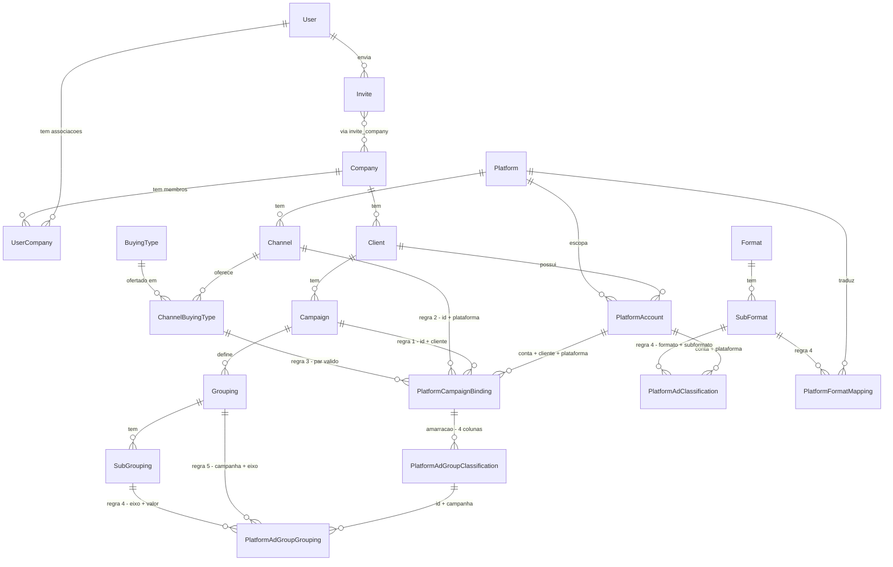

# Modelo de domínio

Referência viva do que cada entidade significa em **binder_app_backend** e por que os
relacionamentos existem. Leia antes de desenhar entidade ou relação nova.

**Regra de manutenção:** atualize este arquivo sempre que uma entidade ou relacionamento for
criado ou alterado. Agentes e pessoas dependem dele para o contexto de negócio.

Invariantes de arquitetura: [../CLAUDE.md](../CLAUDE.md). Modelo Bridge alvo e DDL:
[architecture.md](architecture.md).

## Visão geral

Modelo de acesso multi-empresa sobre uma arquitetura em camadas:

- **Access** — quem pode usar o sistema (`User`, `Company`, `UserCompany`, `Invite`)
- **Business** — espinha organizacional (`Company → Client → Campaign`)
- **Media** — catálogos de vocabulário (`Platform`, `Channel`, `BuyingType`, `Format`,
  `SubFormat`, `Grouping`, `SubGrouping`)
- **Bridge** — liga IDs nativos de plataforma ao significado de negócio

Autenticação é por usuário (um login, um JWT); o acesso a empresas é resolvido em cada
requisição a partir das associações `UserCompany` ativas.

**Escopo dos catálogos:** `Platform`, `Channel`, `BuyingType`, `Format`, `SubFormat` são
**globais**. `Grouping` / `SubGrouping` são **escopados em campanha** — e isso está correto:
é o que faz uma campanha com três plataformas compartilhar o mesmo vocabulário entre elas.

## Diagrama de relacionamentos

Estado **alvo** desta arquitetura. O código ainda tem `PlatformObjectMap` no lugar das tabelas
de Bridge — o que existe hoje × alvo está no plano da iniciativa ativa
(`binder_etl/docs/plans/bridge-enrichment.md`).

## Catálogo de entidades

### User

| | |
|---|---|
| **Business role** | Represents a person who authenticates and operates inside the app. Handles login, authorization by role, and password recovery. |
| **Source file** | `src/access/user/user.entity.ts` |
| **Module** | `src/access/user/user.module.ts` (repository also registered in `AuthModule`) |

**Key fields**

| Field | Business meaning |
|-------|------------------|
| `name` | Display name of the person |
| `email` | Unique login identifier |
| `password` | Hashed credential; never returned in queries (`select: false`) |
| `role` | App-wide permission level (`superadmin`, `editor`, `viewer`) — see `src/shared/role.enum.ts` |
| `isActive` | Whether the account can authenticate |
| `passwordResetToken` / `passwordResetExpires` | Temporary credentials for password recovery flow |
| `createdAt` / `updatedAt` | Audit timestamps |

**Used by**

- `src/access/auth/auth.service.ts` — login, password reset
- `src/access/auth/auth.guard.ts` — JWT validation; loads `userCompanies` to build session
- `src/access/auth/userSignature.type.ts` — exposes `companyIds` from active memberships
- `src/access/user/user.service.ts` — profile and user detail endpoints
- `src/system/database/seeds/access.seed.ts` — seed admin user and company link

**Relationships**

| Related entity | Type | Owning side | Business reason |
|----------------|------|-------------|-----------------|
| UserCompany | OneToMany | UserCompany (`user_id` FK) | User has zero or more company memberships |
| Invite | OneToMany | Invite (`invited_by_id` FK) | User sends zero or more invites |

---

### Company

| | |
|---|---|
| **Business role** | Represents a company unit (organizational scope) in the app. Users operate within the context of the companies they are linked to. |
| **Source file** | `src/access/company/company.entity.ts` |
| **Module** | `src/access/company/company.module.ts` |

**Key fields**

| Field | Business meaning |
|-------|------------------|
| `name` | Full company unit name (unique) |
| `isActive` | Whether the company unit is active; inactive companies are excluded from `companyIds` |
| `description` | Human-readable description of the unit |
| `createdAt` / `updatedAt` | Audit timestamps |

**Used by**

- `src/access/auth/auth.guard.ts` — resolves `companyIds` for the authenticated session
- `src/access/company/company.service.ts` — list and detail endpoints
- `src/system/database/seeds/access.seed.ts` — seed default company and link to admin user

**Relationships**

| Related entity | Type | Owning side | Business reason |
|----------------|------|-------------|-----------------|
| UserCompany | OneToMany | UserCompany (`company_id` FK) | Company has zero or more user memberships |

---

### UserCompany

| | |
|---|---|
| **Business role** | Membership / access grant linking a user to a company unit. Controls whether a logged-in user may access that company. |
| **Source file** | `src/access/user-company/user-company.entity.ts` |
| **Module** | `src/access/user-company/user-company.module.ts` (service-only; imported by `UserModule`) |

**Key fields**

| Field | Business meaning |
|-------|------------------|
| `user` | The user granted access |
| `company` | The company unit being accessed |
| `isActive` | `true` = permitted; `false` = soft-revoked (link kept for audit, access denied) |
| `createdAt` / `updatedAt` | Audit timestamps |

**Used by**

- `src/access/auth/auth.guard.ts` — filters active memberships into `companyIds`
- `src/access/auth/auth.service.ts` — loads memberships on login
- `src/access/user-company/user-company.service.ts` — grant, revoke, bulk sync (Superadmin only)
- `src/access/user-company/user-company.controller.ts` — `PATCH /access/user-companies/:id/revoke`, `PUT /access/user-companies/user/:userId/sync`
- `src/system/database/seeds/access.seed.ts` — creates admin ↔ company link with `status: true`

**Relationships**

| Related entity | Type | Owning side | Business reason |
|----------------|------|-------------|-----------------|
| User | ManyToOne | UserCompany | Each membership belongs to one user |
| Company | ManyToOne | UserCompany | Each membership targets one company |

**Access revocation:** set `status=false` on the row (via `UserCompanyService.revokeById` using the membership row PK). Grant/revoke/sync require Superadmin. The user stays logged in; on the next request `AuthGuard` reloads memberships and excludes the revoked company from `companyIds`.

---

### Invite

| | |
|---|---|
| **Business role** | Stores invite-flow data before a user gains company access. One invite can target multiple companies with a single token and role. On accept, creates `UserCompany` rows and sets the invitee's global role. |
| **Source file** | `src/access/invite/invite.entity.ts` |
| **Module** | `src/access/invite/invite.module.ts` |

**Key fields**

| Field | Business meaning |
|-------|------------------|
| `email` | Invitee email address (normalized to lowercase in service layer) |
| `token` | Unique public token for accept/refuse links (no auth required) |
| `role` | App-wide role to assign on accept (`superadmin`, `editor`, `viewer`) |
| `status` | Lifecycle: `pending`, `accepted`, `refused`, `expired`, `cancelled` |
| `expiresAt` | Invite expiry (default 7 days); passed invites become `expired` |
| `acceptedAt` / `refusedAt` / `cancelledAt` | Timestamps for terminal transitions |
| `invitedBy` | User who sent the invite |
| `companies` | One or more company units included in this invite |
| `createdAt` / `updatedAt` | Audit timestamps |

**Lifecycle**

| Status | Terminal? | Next actions |
|--------|-----------|--------------|
| `pending` | No | Accept, refuse, cancel, or expire |
| `expired` | No | Resend (new token + expiry → `pending`) or cancel |
| `accepted` | Yes | Flow complete — `UserCompany` rows created |
| `refused` | Yes | Flow complete — invitee declined |
| `cancelled` | Yes | Flow complete — inviter revoked invite |

**Used by**

- `src/access/invite/invite.service.ts` — full invite lifecycle:
  - `POST /invite` — create + email (Editor/Superadmin)
  - `GET /invite` — list sent invites
  - `POST /invite/:id/cancel` — cancel pending/expired
  - `POST /invite/:id/resend` — resend expired
  - `POST /invite/accept` — public; creates **new user only** (rejects existing email)
  - `POST /invite/refuse` — public; marks refused
- `src/system/mail/mail.service.ts` — `sendInviteEmail` on create/resend

**Accept constraint:** invite accept is for **new users only**. If the email already exists, create and accept both reject — role/company changes for existing users belong to a separate flow.

**Relationships**

| Related entity | Type | Owning side | Business reason |
|----------------|------|-------------|-----------------|
| User | ManyToOne | Invite (`invited_by_id` FK) | Every invite is sent by one user |
| Company | ManyToMany | Invite (`invite_company` junction) | One invite can grant access to multiple companies at once |

**Authorization rules (enforced in service, not entity):**

- Superadmin: invite to any active company; assign any role
- Editor: invite only to companies they belong to; assign `editor` or `viewer` only
- Viewer: cannot invite

---

### Client

| | |
|---|---|
| **Business role** | Represents a client account won by a company unit (e.g. Caixa, SERPRO under Binder-DF). |
| **Source file** | `src/business/client/client.entity.ts` |
| **Module** | `src/business/client/client.module.ts` (entities only, no routes) |

**Key fields**

| Field | Business meaning |
|-------|------------------|
| `name` | Client name (unique per company) |
| `description` | Human-readable description |
| `isActive` | Whether the client is active |
| `company` | Owning company unit |
| `createdAt` / `updatedAt` | Audit timestamps |

**Relationships**

| Related entity | Type | Owning side | Business reason |
|----------------|------|-------------|-----------------|
| Company | ManyToOne | Client (`company_id` FK) | Each client belongs to one company |
| Campaign | OneToMany | Campaign (`client_id` FK) | Client has zero or more campaigns |

**Seeded by**

- `src/system/database/seeds/business.seed.ts` — Caixa client under Binder-DF

---

### Campaign

| | |
|---|---|
| **Business role** | Represents a marketing initiative for a client (e.g. Mega da Virada 2025, Always On). |
| **Source file** | `src/business/campaign/campaign.entity.ts` |
| **Module** | `src/business/campaign/campaign.module.ts` (entities only, no routes) |

**Key fields**

| Field | Business meaning |
|-------|------------------|
| `name` | Campaign name (unique per client) |
| `description` | Human-readable description |
| `isActive` | Whether the campaign is active |
| `client` | Parent client account |
| `createdAt` / `updatedAt` | Audit timestamps |

**Relationships**

| Related entity | Type | Owning side | Business reason |
|----------------|------|-------------|-----------------|
| Client | ManyToOne | Campaign (`client_id` FK) | Each campaign belongs to one client |
| Grouping | OneToMany | Grouping (`campaign_id` FK) | Campaign defines strategic dimension types |

**Must NOT store:** platform-native IDs (`campaign_id`, `ad_group_id`, `ad_id`) — Bridge layer owns those mappings.

**Seeded by**

- `src/system/database/seeds/business.seed.ts` — Always ON 2026 campaign under Caixa

---

### Platform

| | |
|---|---|
| **Business role** | Global catalog of media platforms where ads run (Google, TikTok, Pinterest, OOH, TV). |
| **Source file** | `src/media/platform/platform.entity.ts` |
| **Module** | `src/media/platform/platform.module.ts` |

**Key fields**

| Field | Business meaning |
|-------|------------------|
| `name` | Platform name (globally unique) |
| `catalogKey` | ETL lake catalog slug (`tiktok`, `google`, `meta`, …); null if no lake catalog yet |
| `description` | Human-readable description |
| `isActive` | Whether the platform entry is active |
| `createdAt` / `updatedAt` | Audit timestamps |

**Relationships**

| Related entity | Type | Owning side | Business reason |
|----------------|------|-------------|-----------------|
| Channel | OneToMany | Channel (`platform_id` FK) | Platform has zero or more channels |

**Seeded by**

- `src/system/database/seeds/media.seed.ts` — TikTok platform

---

### Channel

| | |
|---|---|
| **Business role** | Sub-division of a platform (e.g. Google Search, Google YouTube). Defines which buying types are valid. |
| **Source file** | `src/media/platform/channel.entity.ts` |
| **Module** | `src/media/platform/platform.module.ts` |

**Key fields**

| Field | Business meaning |
|-------|------------------|
| `name` | Channel name (unique per platform) |
| `description` | Human-readable description |
| `isActive` | Whether the channel entry is active |
| `platform` | Parent platform |
| `channelBuyingTypes` | Allowed buying models on this channel, via the `ChannelBuyingType` link |
| `createdAt` / `updatedAt` | Audit timestamps |

**Relationships**

| Related entity | Type | Owning side | Business reason |
|----------------|------|-------------|-----------------|
| Platform | ManyToOne | Channel (`platform_id` FK) | Each channel belongs to one platform |
| BuyingType | ManyToMany | Channel (`channel_buying_type` junction) | Channel supports one or more buying types (e.g. YouTube → CPM + CPV) |

**Seeded by**

- `src/system/database/seeds/media.seed.ts` — TikTok Ads and TikTok Search channels

---

### BuyingType

| | |
|---|---|
| **Business role** | Global catalog of buying/pricing models (CPC, CPM, CPV, CPA, CPE, Flat). |
| **Source file** | `src/media/platform/buying-type.entity.ts` |
| **Module** | `src/media/platform/platform.module.ts` |

**Key fields**

| Field | Business meaning |
|-------|------------------|
| `name` | Buying type name (globally unique) |
| `description` | Human-readable description |
| `isActive` | Whether the entry is active |
| `createdAt` / `updatedAt` | Audit timestamps |

**Relationships**

| Related entity | Type | Owning side | Business reason |
|----------------|------|-------------|-----------------|
| ChannelBuyingType | OneToMany | Link (`buying_type_id` FK) | Os canais em que este buying type é ofertado |

**Note:** o catálogo define o que é *possível* num canal. O buying type efetivo é escolhido no Bridge, em `PlatformCampaignBinding` — nível campanha, vindo do plano de mídia (não de `billing_event` da plataforma).

**Seeded by**

- `src/system/database/seeds/media.seed.ts` — CPM, CPV, CPC, CPA, CPE

---

### ChannelBuyingType

| | |
|---|---|
| **Papel de negócio** | Quais tipos de compra são válidos em cada canal. |
| **Arquivo** | `src/media/platform/channel-buying-type.entity.ts` |
| **Status** | Implementada |

**Campos**

| Campo | Significado |
|---|---|
| `channelId` / `buyingTypeId` | PK composta — é o par, e é o índice que a regra 3 ancora |

**Por que é entidade explícita, e não `@JoinTable`.** O `PlatformCampaignBinding` precisa de
FK composta `(channel_id, buying_type_id)` para impor a regra 3, e **FK não referencia tabela
de junção que só existe em metadado de `@ManyToMany`** — não há classe para o `@ManyToOne`
apontar. Promover a junção é o que a skill `create-entities` já prescreve para esse caso.

**Relações**

| Entidade | Tipo | Lado dono | Razão de negócio |
|---|---|---|---|
| Channel | ManyToOne | Link (`channel_id` FK) | O vínculo pertence ao canal |
| BuyingType | ManyToOne | Link (`buying_type_id` FK) | O vínculo aponta o tipo de compra |

`Channel.channelBuyingTypes` usa `cascade: ['insert','update']` + `orphanedRowAction: 'delete'`,
então salvar o canal com a lista reatribuída sincroniza os vínculos e apaga os órfãos.

---

### Format

| | |
|---|---|
| **Business role** | Global catalog of creative format types (static, video). |
| **Source file** | `src/media/format/format.entity.ts` |
| **Module** | `src/media/format/format.module.ts` |

**Key fields**

| Field | Business meaning |
|-------|------------------|
| `name` | Format name (globally unique) |
| `description` | Human-readable description |
| `isActive` | Whether the entry is active |
| `createdAt` / `updatedAt` | Audit timestamps |

**Relationships**

| Related entity | Type | Owning side | Business reason |
|----------------|------|-------------|-----------------|
| SubFormat | OneToMany | SubFormat (`format_id` FK) | Format has zero or more sub-formats |

**Seeded by**

- `src/system/database/seeds/media.seed.ts` — Video and Static formats with sub-formats

---

### SubFormat

| | |
|---|---|
| **Business role** | Finer creative specification under a format (carousel, card; 6s GIF, 15s, 30s video). |
| **Source file** | `src/media/format/sub-format.entity.ts` |
| **Module** | `src/media/format/format.module.ts` |

**Key fields**

| Field | Business meaning |
|-------|------------------|
| `name` | Sub-format name (unique per format) |
| `description` | Human-readable description |
| `isActive` | Whether the entry is active |
| `format` | Parent format |
| `createdAt` / `updatedAt` | Audit timestamps |

**Relationships**

| Related entity | Type | Owning side | Business reason |
|----------------|------|-------------|-----------------|
| Format | ManyToOne | SubFormat (`format_id` FK) | Each sub-format belongs to one format |

**Seeded by**

- `src/system/database/seeds/media.seed.ts` — Motion, Externa, GIF, Card, Carrossel

---

### Grouping

| | |
|---|---|
| **Business role** | Campaign-scoped strategic dimension type (Territory, Theme). Options vary per campaign. Scoped to Binder campaign intentionally so every ETL object mapped under that campaign can reuse the same dimensions. |
| **Source file** | `src/business/grouping/grouping.entity.ts` |
| **Module** | `src/business/grouping/grouping.module.ts` |

**Key fields**

| Field | Business meaning |
|-------|------------------|
| `name` | Grouping name (unique per campaign) |
| `description` | Human-readable description |
| `isActive` | Whether the entry is active |
| `campaign` | Parent Binder campaign |
| `createdAt` / `updatedAt` | Audit timestamps |

**Relationships**

| Related entity | Type | Owning side | Business reason |
|----------------|------|-------------|-----------------|
| Campaign | ManyToOne | Grouping (`campaign_id` FK) | Strategic dimensions belong to a specific campaign |
| SubGrouping | OneToMany | SubGrouping (`grouping_id` FK) | Grouping has zero or more values |

**Seeded by**

- `src/system/database/seeds/media.seed.ts` — Territory and Persona groupings on Always ON 2026

---

### SubGrouping

| | |
|---|---|
| **Business role** | Value under a campaign grouping (e.g. Territory → Canais, Crédito, Oportunidades e Clientes). |
| **Source file** | `src/business/grouping/sub-grouping.entity.ts` |
| **Module** | `src/business/grouping/grouping.module.ts` |

**Key fields**

| Field | Business meaning |
|-------|------------------|
| `name` | Sub-grouping name (unique per grouping) |
| `description` | Human-readable description |
| `isActive` | Whether the entry is active |
| `grouping` | Parent grouping dimension |
| `createdAt` / `updatedAt` | Audit timestamps |

**Relationships**

| Related entity | Type | Owning side | Business reason |
|----------------|------|-------------|-----------------|
| Grouping | ManyToOne | SubGrouping (`grouping_id` FK) | Each value belongs to one grouping |

**Seeded by**

- `src/system/database/seeds/media.seed.ts` — Territory and Persona sub-grouping values

---

### PlatformAccount

| | |
|---|---|
| **Business role** | Links a client's platform ad account to Binder. ETL `account_id` joins here to resolve client, company, and platform context. An ad account belongs to **exactly one client** — the lake fact carries no client, so a shared account would multiply metric rows on the enrichment join. |
| **Source file** | `src/bridge/platform-account/platform-account.entity.ts` |
| **Module** | `src/bridge/platform-account/platform-account.module.ts` |

**Key fields**

| Field | Business meaning |
|-------|------------------|
| `externalAccountId` | Platform-native account ID from ETL (unique per platform) |
| `name` | Human-readable label (e.g. "Caixa Google Ads") |
| `isActive` | Whether this account mapping is active |
| `client` | Client this row binds the account to — exactly one, with no sibling rows for other clients |
| `platform` | Which platform catalog applies |
| `createdAt` / `updatedAt` | Audit timestamps |

**Relationships**

| Related entity | Type | Owning side | Business reason |
|----------------|------|-------------|-----------------|
| Client | ManyToOne | PlatformAccount (`client_id` FK) | The account belongs to exactly one client; a client may own many accounts |
| Platform | ManyToOne | PlatformAccount (`platform_id` FK) | Account runs on one platform |
| PlatformCampaignBinding | OneToMany | Binding (`platform_account_id` FK) | Conta contém vínculos de campanha |
| PlatformAdClassification | OneToMany | Classification (`platform_account_id` FK) | Conta contém exceções de formato |

**Uniqueness:** `UNIQUE (platform_id, external_account_id)` — an `external_account_id` appears at most once per platform, so it resolves to exactly one client.

**ETL join:** `facts.account_id` → `platform_account.external_account_id` (scoped by platform), resolving to **exactly one row**. The lake fact carries no client, so nothing downstream could disambiguate a shared account — uniqueness here is what keeps the enrichment join from multiplying metric rows.

**API / lifecycle** (`platform-account.service.ts`):

- CRUD via `GET/POST/PATCH /bridge/platform-accounts`; bulk hard-delete via `DELETE /bridge/platform-accounts` body `{ ids }` (Superadmin). Apagar uma conta cascateia as linhas filhas do Bridge (FK `ON DELETE CASCADE`).
- Bulk create via `POST /bridge/platform-accounts/bulk` body `{ platformId, accounts[], clientId }` — writes one row per account, all for the same client (Superadmin).
- Changing `clientId` on update **hard-deletes all child maps first**, then saves the new client (maps must not outlive the account–client binding).

---

### PlatformCampaignBinding

| | |
|---|---|
| **Papel de negócio** | Onde a campanha de negócio **nasce**. Vincula uma campanha nativa da plataforma a uma `Campaign` do Binder e carrega os rótulos de nível campanha. É o único lugar onde `campaign_id` é digitado. |
| **Arquivo alvo** | `src/bridge/platform-campaign-binding.entity.ts` |
| **Status** | Implementada |

**Campos**

| Campo | Significado |
|---|---|
| `platformAccount` | Escopo da conta (e portanto do cliente e da plataforma) |
| `externalCampaignId` | ID nativo da campanha na plataforma |
| `campaign` | Campanha de negócio alvo — `NOT NULL` |
| `channel` | Canal — `NOT NULL` |
| `buyingTypeId` | Tipo de compra do plano de mídia — `NOT NULL`. A relação é `channelBuyingType`, o par `(channel, buying type)` que a regra 3 exige |

**Unicidade:** `UNIQUE (platform_account_id, external_campaign_id)` — também serve de alvo
para a FK composta vinda de `PlatformAdGroupClassification`.

**Integridade:** `campaign.client` deve ser igual a `platformAccount.client`;
`channel.platform` igual à plataforma da conta; o buying type deve ser válido para o canal.

---

### PlatformAdGroupClassification

| | |
|---|---|
| **Papel de negócio** | Classificação de um ad group nos eixos declarados pela campanha. Não guarda campanha de negócio — alcança por FK composta até o binding. |
| **Arquivo alvo** | `src/bridge/platform-ad-group-classification.entity.ts` |
| **Status** | Implementada |

**Campos**

| Campo | Significado |
|---|---|
| `platformAccountId` | Escopo da conta. Não há relação direta para `PlatformAccount` de propósito — a FK composta para o binding já fixa a coluna |
| `externalAdGroupId` | ID nativo do ad group |
| `externalCampaignId` | **Derivado do catálogo, nunca digitado.** Alvo da FK composta |

**Unicidade:** `UNIQUE (platform_account_id, external_ad_group_id)`

**A amarração:** `FOREIGN KEY (platform_account_id, external_campaign_id) REFERENCES
platform_campaign_binding (platform_account_id, external_campaign_id)`. Classificar ad group
de campanha não vinculada é impossível, e não existe segunda cópia da campanha de negócio
para divergir.

---

### PlatformAdGroupGrouping

| | |
|---|---|
| **Papel de negócio** | A atribuição de valor de eixo: "ad group 456 tem Território = Canais". Substitui o M2M solto `platform_object_map_sub_grouping`. |
| **Arquivo alvo** | `src/bridge/platform-ad-group-grouping.entity.ts` |
| **Status** | Implementada |

**Campos**

| Campo | Significado |
|---|---|
| `adGroupClassification` | Objeto classificado |
| `grouping` | O eixo. Desnormalizado de propósito, para viabilizar as duas constraints |
| `subGrouping` | O valor escolhido nesse eixo |

**Constraints que substituem validação em código**

- `PRIMARY KEY (ad_group_classification_id, grouping_id)` — um único valor por eixo.
- `FOREIGN KEY (grouping_id, sub_grouping_id) REFERENCES sub_grouping (grouping_id, id)` —
  o valor pertence ao eixo declarado. Requer `CREATE UNIQUE INDEX ON sub_grouping (grouping_id, id)`.

---

### PlatformAdClassification

| | |
|---|---|
| **Papel de negócio** | Formato de um ad. Existe apenas como **exceção** à tradução automática de `ad_format` nativo. |
| **Arquivo alvo** | `src/bridge/platform-ad-classification.entity.ts` |
| **Status** | Implementada |

**Campos**

| Campo | Significado |
|---|---|
| `platformAccountId` / `platformAccount` | Escopo da conta, amarrado pela FK composta `(platform_account_id, platform_id)` |
| `externalAdId` | ID nativo do ad |
| `format` / `subFormat` | Sobrescrita manual da tradução |

**Unicidade:** `UNIQUE (platform_account_id, external_ad_id)`
**Integridade:** `FOREIGN KEY (format_id, sub_format_id) REFERENCES sub_format (format_id, id)`

---

### PlatformFormatMapping

| | |
|---|---|
| **Papel de negócio** | Traduz o valor nativo de formato da plataforma para o vocabulário interno. Poucas linhas por plataforma (3 no TikTok hoje) em vez de N classificações por ad. |
| **Arquivo alvo** | `src/bridge/platform-format-mapping.entity.ts` |
| **Status** | Implementada |

**Campos**

| Campo | Significado |
|---|---|
| `platform` | Plataforma de origem |
| `nativeValue` | Valor cru, ex.: `CAROUSEL_ADS`, `SINGLE_VIDEO` |
| `formatId` / `subFormat` | Destino no vocabulário Binder. A relação é para `SubFormat`, pelo par `(format_id, sub_format_id)` da regra 4 |

**Unicidade:** `UNIQUE (platform_id, native_value)`

Valor nativo sem tradução **nunca quebra a rodada do ETL**: o ad recebe `'Não mapeado'`, o
gold carrega o valor cru, e o backend expõe a fila de pendências ordenada por investimento
afetado.

---

### EnrichmentPublication

| | |
|---|---|
| **Papel de negócio** | Congela um snapshot do enriquecimento para o DAG consumir. Configurar não dispara processamento; publicar sim, uma vez para o lote inteiro. |
| **Arquivo alvo** | `src/bridge/enrichment-publication.entity.ts` |
| **Status** | **Alvo** — ainda não existe no código |

**Campos**

| Campo | Significado |
|---|---|
| `publishedAt` / `publishedBy` | Quando e por quem |
| `status` | `pending` \| `materialized` \| `superseded` |

O DAG usa a publicação mais recente e o snapshot congelado, nunca as tabelas vivas — isso torna
a rodada reprodutível e dá o rastro de auditoria que o SCD tipo 1 não guarda. Publicar de novo
antes de a anterior ser usada marca a anterior como `superseded`.

Falha **não** é status de publicação: o gold enriquecido é reconstruído a cada rodada diária,
então uma publicação é usada em muitas rodadas e o resultado de cada uma vive em
`EnrichmentRun`.

---

### EnrichmentRun

| | |
|---|---|
| **Papel de negócio** | Registra cada execução do enriquecimento pelo DAG: quando rodou, com qual publicação, e se deu certo. É o que sustenta o aviso "a última rodada falhou" na tela. |
| **Arquivo alvo** | `src/bridge/enrichment-run.entity.ts` |
| **Status** | **Alvo** — ainda não existe no código |

**Campos**

| Campo | Significado |
|---|---|
| `publicationId` | Qual configuração a rodada usou |
| `startedAt` / `finishedAt` | Janela da execução |
| `status` | `success` \| `failed` |
| `errorMessage` | Diagnóstico quando falha |

Contar falhas consecutivas é um `SELECT` aqui. Não há limite de tentativas: reconstruir é o
trabalho normal do dia, e travar congelaria o gold também em relação ao fato novo. A cobertura
do enriquecimento também é métrica de rodada, e é aqui que ela cabe.

---

### PlatformObjectMap (legado)

Tabela larga com `object_type` e validação em `assertLevelFields`. **Ainda é o código em
produção.** Sai só depois que o gold enriquecido estiver reconciliando. Não construa nada
novo sobre ela, e não a remova fora do plano da iniciativa ativa.

---

## Mapa de relacionamentos

| De | Para | Tipo | Junção / FK | Lado dono | Razão |
|---|---|---|---|---|---|
| User | UserCompany | OneToMany | `user_company.user_id` | UserCompany | Usuário tem várias associações |
| Company | UserCompany | OneToMany | `user_company.company_id` | UserCompany | Empresa tem vários membros |
| User | Invite | OneToMany | `invite.invited_by_id` | Invite | Usuário envia convites |
| Invite | Company | ManyToMany | `invite_company` | Invite | Um convite pode alvejar várias empresas |
| Company | Client | OneToMany | `client.company_id` | Client | Empresa tem clientes |
| Client | Campaign | OneToMany | `campaign.client_id` | Campaign | Cliente tem campanhas |
| Platform | Channel | OneToMany | `channel.platform_id` | Channel | Plataforma tem canais |
| Channel | ChannelBuyingType | OneToMany | `channel_buying_type.channel_id` | Link | Canal oferta tipos de compra |
| BuyingType | ChannelBuyingType | OneToMany | `channel_buying_type.buying_type_id` | Link | Tipo de compra é ofertado em canais |
| Format | SubFormat | OneToMany | `sub_format.format_id` | SubFormat | Formato tem subformatos |
| Campaign | Grouping | OneToMany | `grouping.campaign_id` | Grouping | Campanha declara seus eixos |
| Grouping | SubGrouping | OneToMany | `sub_grouping.grouping_id` | SubGrouping | Eixo tem valores |
| Client | PlatformAccount | OneToMany | `platform_account.client_id` | PlatformAccount | Cliente tem contas |
| Platform | PlatformAccount | OneToMany | `platform_account.platform_id` | PlatformAccount | Plataforma escopa contas |
| PlatformAccount | PlatformCampaignBinding | OneToMany | `platform_campaign_binding.platform_account_id` | Binding | Conta contém vínculos de campanha |
| Campaign | PlatformCampaignBinding | OneToMany | `platform_campaign_binding.campaign_id` | Binding | Campanha recebe vários vínculos (Always On) |
| PlatformCampaignBinding | PlatformAdGroupClassification | OneToMany | FK composta `(platform_account_id, external_campaign_id, campaign_id, platform_id)` | Classification | **A amarração** — 4 colunas |
| PlatformAdGroupClassification | PlatformAdGroupGrouping | OneToMany | `ad_group_classification_id` | Grouping row | Atribuição de eixo |
| SubGrouping | PlatformAdGroupGrouping | OneToMany | FK composta `(grouping_id, sub_grouping_id)` | Grouping row | Regra 4 — valor coerente com o eixo |
| Grouping | PlatformAdGroupGrouping | OneToMany | FK composta `(campaign_id, grouping_id)` | Grouping row | Regra 5 — eixo é da campanha do binding |
| PlatformAccount | PlatformAdClassification | OneToMany | `platform_ad_classification.platform_account_id` | Classification | Exceção de formato |
| Platform | PlatformFormatMapping | OneToMany | `platform_format_mapping.platform_id` | Mapping | Tradução por plataforma |

**Junção `user_company`** — entidade explícita com `id`, `isActive` e timestamps.
`UNIQUE (user_id, company_id)`; `status=false` é revogação suave sem exigir novo login.

**Junção `invite_company`** — `@JoinTable` em `Invite`, sem inverso em `Company`.
Colunas `invite_id`, `company_id`.

**`channel_buying_type` é entidade, não `@JoinTable`** — FK composta não referencia junção que só vive em metadado de `@ManyToMany`. `Channel.channelBuyingTypes` cascateia e apaga órfãos.
Define quais modelos de compra são válidos num canal (catálogo apenas).

**`platform_ad_group_grouping` não é `@ManyToMany`.** A PK composta e a FK composta exigem
entidade explícita — ver [relationships.md](../.claude/skills/create-entities/relationships.md),
seção "ManyToMany com colunas extras".

---

## New Entity Template

Copy this section when adding the next entity. Replace placeholders and move it above this template block.

### \<EntityName\>

| | |
|---|---|
| **Business role** | \<Why this entity exists in the domain\> |
| **Source file** | `src/\<feature\>/\<feature\>.entity.ts` |
| **Module** | `src/\<feature\>/\<feature\>.module.ts` |

**Key fields**

| Field | Business meaning |
|-------|------------------|
| \<field\> | \<meaning\> |

**Used by**

- \<module or service that consumes this entity\>

**Relationships**

| Related entity | Type | Owning side | Business reason |
|----------------|------|-------------|-----------------|
| \<Entity\> | \<OneToMany / ManyToOne / ManyToMany / OneToOne\> | \<side\> | \<why this relation exists\> |

After adding a section:

1. Update the **Relationship Map** table above
2. Update the **mermaid diagram** at the top
3. Update inverse relations on any affected existing entities (in code)
